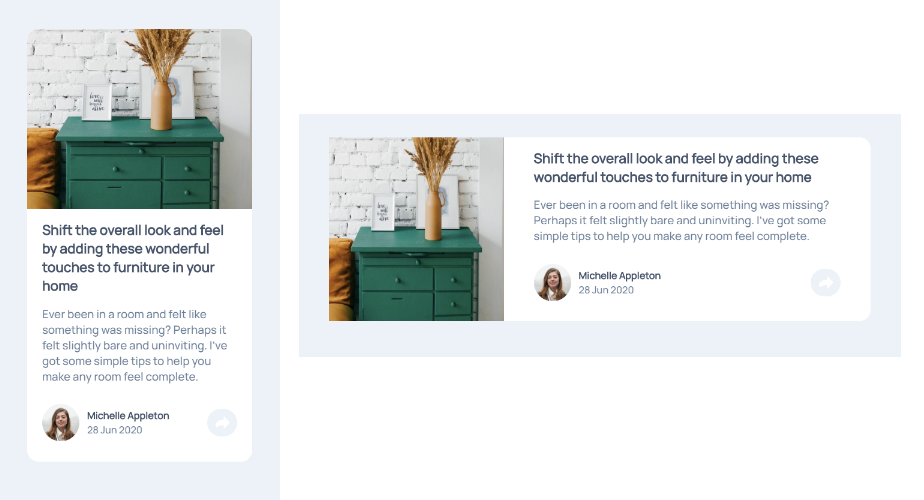

# Artical Preview component with HTML & CSS

This is a solution to the [Artical Preview component challenge on Frontend Mentor](https://www.frontendmentor.io/challenges/article-preview-component-dYBN_pYFT). Frontend Mentor challenges help you improve your coding skills by building realistic projects.

## Table of contents

- [The challenge](#the-challenge)
- [Links](#links)
- [Built with](#built-with)
- [Author](#author)

### The challenge

- Build out the project to the designs provided.

### Links

- [Live Site URL](https://jcsmileyjr.github.io/Social-Proof/)
- [Read the blog post](https://dev.to/jcsmileyjr/frontend-challenge-6-social-proof-component-25e)

### Built with

- Semantic HTML5 markup
- CSS custom properties
- Flexbox
- Mobile-first workflow

## Author

- Website - [JC Smiley](https://www.jcsmileyjr.com)
- Frontend Mentor - [@jcsmileyjr](https://www.frontendmentor.io/profile/jcsmileyjr)
- Twitter - [@JCSmiley4](https://twitter.com/JCSmiley4)
